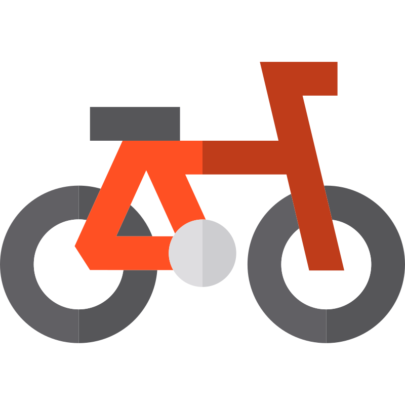

# karoo-custom-mapstyle-gravel

A custom map style for Hammerhead Karoo 3, based on the original `offline_v15.xml`, focused on gravel riding, bikepacking, and clearer distinction of roads, paths, surfaces, and useful POIs.

This project starts from the original Hammerhead Karoo 3 V15 style. Inspiration and selected ideas come from [dansoft-ch/karoo-custom-mapstyle](https://github.com/dansoft-ch/karoo-custom-mapstyle).

## Contents

- `offline_v15.xml` - current map style.
- `icons-kmen/` - additional and customized POI icons.
- `docs/legend_kmen_compact.html` - compact legend for quick mobile reference.

## Key changes

- Clearer bike-related paths:
  - `highway=cycleway`
  - `highway=path + bicycle=yes|designated`
  - `highway=path + cycleway=*`
  - bike route networks `icn`, `ncn`, `rcn`, `lcn`
- Better distinction for tracks, rural roads, and unpaved surfaces:
  - `tracktype=grade1..grade5`
  - better unpaved `compacted|gravel|fine_gravel`
  - rougher unpaved `ground|dirt|grass|sand|unpaved`
  - separate styles for non-bike `highway=path`
- Bikepacking-focused POI visibility:
  - camping, caravan site, hostel/hotel/lodging
  - shelter/hut
  - slipway/marina/dock/canoe-kayak access
  - fuel, drinking water, supermarket, coffee, bike service
- Darker forest, more visible sand/beach and natural terrain.
- Stronger town and city labels.
- Brown contour lines with lower elevation-label priority.

## Installation on Hammerhead Karoo 3

1. Connect Karoo 3 to your computer via USB.
2. Enable developer options on Karoo if they are not already enabled.
3. In developer settings, set the default USB mode to file transfer.
4. Open Karoo internal storage.
5. Locate the current style file, for example `offline_v15.xml`.
6. Create a backup, for example `offline_v15.xml.backup`.
7. Copy from this repository to the Karoo storage root:
   - `offline_v15.xml`
   - `icons-kmen` directory
8. Make sure the style filename matches the version expected by your Karoo firmware.
   - for version 15: `offline_v15.xml`
   - if your Karoo uses another version, rename accordingly, e.g. `offline_v16.xml`
9. Disconnect Karoo and reopen map view, or reboot the device.

After major Karoo system updates, the style may be overwritten. In that case, copy the XML again and ensure the filename matches the current `offline_vXX.xml` version.

## Legend — Legenda Kmen V15

> Aktualny styl: `offline_v15.xml`.  
> Interaktywna wersja mobilna: [`docs/legend_kmen_compact.html`](docs/legend_kmen_compact.html)

### 🚴 Rower

| Element | Tagi | Kolor / wygląd |
|---------|------|----------------|
| Ścieżka rowerowa | `highway=cycleway` | ━━━━━ |
| Cycleway nieutwardzona | `highway=cycleway` + szuter/ziemia/piasek | ━━━━━ ━━━ |
| Path z dostępem rowerowym | `highway=path` + `bicycle=yes\|designated` | ━━━━━ ━━━ |
| Path z cycleway | `highway=path` + `cycleway=*` | ━━━━━ ━━━ |
| Trasy rowerowe | `icn/ncn/rcn/lcn=yes`, szerokie kolorowe podbicie | ━━━━━━━ |

### 🥾 Track i ścieżki nie-rowerowe

| Element | Tagi | Kolor / wygląd |
|---------|------|----------------|
| Path zwykły | `highway=path` bez roweru | ╌╌╌╌╌ |
| Dobry path | `surface=compacted\|gravel\|fine_gravel` | ╍╍╍╍╍ |
| Gorszy path | `surface=ground\|dirt\|grass\|unpaved` | ╌╌╌╌╌ |
| Piaszczysty path | `surface=sand` | ····· |
| Track bez grade | `highway=track` | ╌╌╌╌╌ |
| Track grade1 | najlepszy, prawie pełna linia | ━━━━━ |
| Track grade2 | długie kreski | ╍╍╍╍╍ |
| Track grade3 | średnie kreski | ╌╌╌╌╌ |
| Track grade4 | krótsze kreski | ╌╌╌ |
| Track grade5 | najgorszy, prawie kropkowany | ····· |

### 🛣️ Drogi zwykłe

| Element | Tagi | Kolor / wygląd |
|---------|------|----------------|
| Autostrada / trunk | `motorway\|motorway_link\|trunk\|trunk_link` | ━━━━━ |
| Droga główna | `primary\|primary_link` | ━━━━━ obwódka / biały rdzeń |
| Droga średnia | `secondary\|secondary_link` | ━━━━ obwódka / biały rdzeń |
| Droga lokalna | `tertiary\|tertiary_link` | ━━━━ obwódka / biały rdzeń |
| Ulica / osiedlowa | `residential\|living_street` | ━━━ obwódka / biały rdzeń |
| Road / unclassified | `unclassified\|road` | ━━━ obwódka / biały rdzeń |
| Service | `driveway\|parking_aisle\|alley` | ━━━━━ |

### 🪨 Drogi nieutwardzone

| Element | Tagi | Kolor / wygląd |
|---------|------|----------------|
| Dobra nieutwardzona | `compacted\|gravel\|fine_gravel`, obwódka jak V15 | ╍╍╍╍╍ biały rdzeń |
| Gorsza nieutwardzona | `ground\|dirt\|grass\|sand\|unpaved`, obwódka jak V15 | ╌╌╌╌╌ biały rdzeń |
| Zwykła lokalna | `residential\|unclassified\|road` bez surface | ━━━━ |

### 🌿 Teren

| Element | Tagi | Kolor |
|---------|------|-------|
| Las / puszcza | `landuse=forest`, `natural=wood` | ████ `#85AF77` |
| Piasek / plaża | `natural=sand\|beach` | ████ `#D3C274` |
| Łąki / zarośla | `grassland\|scrub` | ████ `#8ed496` |
| Pola / naturalne tło | farmland, meadow, orchard itd. | ████ `#E0D88D` |
| Woda | rzeka, jezioro, dock | ████ `#6aabb8` |
| Lodowiec | `glacier\|ice_shelf` | ████ `#88F7F7` |

### 📍 POI bikepacking

| Ikona | Element |
|-------|---------|
|  | camping / caravan od z11 |
|  | slipway / marina |
|  | nocleg / hostel / hotel |
|  | shelter / hut |
|  | kajak / canoe |
|  | stacja paliw |
|  | woda pitna |
|  | rowery / serwis |
|  | supermarket |
|  | kawiarnia |

### 🗺️ Poziomice i nazwy

| Element | Parametry | Kolor |
|---------|-----------|-------|
| Poziomica pomocnicza | minor contour, 1 px | ━━━━━ `#938945` |
| Poziomica główna | major contour, 3 px, etykieta priority 1 | ━━━━━ `#938945` |
| **City** | zoom 6, priority 70, size 20 | pogrubiona, duża |
| **Town** | zoom 7, priority 50, size 18 | pogrubiona |
| **Village** | zoom 9, priority 40, size 17 | standardowa |
| **Hamlet** | zoom 11, priority 30, size 16 | mniejsza, szara |

## Notes

The style depends on tags stored in the offline `.map` file. If a tag exists in online OpenStreetMap but is not present in the Karoo offline map extract, the style cannot render it.

Example: if the offline map does not contain `leisure=marina`, the marina rule will not appear, even if marina objects are visible in online OSM.

## Inspiration and installation references

- [dansoft-ch/karoo-custom-mapstyle](https://github.com/dansoft-ch/karoo-custom-mapstyle)
- [Wgranie nowego stylu map do Karoo Hammerhead 3](https://bobiko.blog/2026/02/hammerhead-karoo3-style/)
